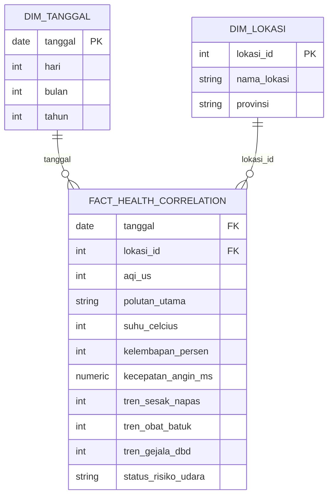

# 🌫️ AeroHealth Data Pipeline

> Analisis Korelasi Kualitas Udara (AQI) & Tren Gejala Pernapasan di Pekanbaru

End-to-end data engineering pipeline yang secara otomatis menarik, memproses, dan memvisualisasikan data kualitas udara serta tren pencarian gejala kesehatan pernapasan, untuk melihat apakah ada korelasi antara keduanya di Kota Pekanbaru, Riau.

Dibuat sebagai final project bootcamp **Data Engineering — Dibimbing.id (Batch 14)**.

---

## 📋 Daftar Isi

- [Latar Belakang](#-latar-belakang)
- [Arsitektur](#-arsitektur)
- [Tech Stack](#-tech-stack)
- [Struktur Folder](#-struktur-folder)
- [Data Model (ERD)](#-data-model-erd)
- [Cara Menjalankan](#-cara-menjalankan)
- [Mengakses Tiap Layanan](#-mengakses-tiap-layanan)
- [Alur Pipeline (DAG)](#-alur-pipeline-dag)
- [Keamanan Credential](#-keamanan-credential)
- [Keterbatasan](#-keterbatasan)
- [Rencana Pengembangan](#-rencana-pengembangan)
- [Kontak](#-kontak)

---

## 🎯 Latar Belakang

Polusi udara berisiko tinggi memicu penyakit pernapasan, tapi data kualitas udara dan data tren gejala penyakit selama ini tersebar di platform yang berbeda — masing-masing punya API terpisah dan tidak terintegrasi, sehingga menyulitkan pemantauan korelasinya.

Project ini membangun **single source of truth** berupa data warehouse yang terotomatisasi penuh, menghilangkan kebutuhan menarik data secara manual setiap hari untuk keperluan analisis.

**Siapa yang diuntungkan:**
- Pemerintah daerah & instansi kesehatan (Dinas Kesehatan)
- Masyarakat Pekanbaru, untuk mengambil langkah antisipasi dini saat kualitas udara (seperti kabut asap) memburuk

---

## 🏗️ Arsitektur

```
┌─────────────┐   ┌──────────┐   ┌─────────┐   ┌──────────────────┐   ┌────────────┐   ┌───────────┐
│   Extract   │──▶│ Raw Zone │──▶│  Load   │──▶│  Transform (dbt)  │──▶│  Transform │──▶│ Visualize │
│  (Python)   │   │ (MinIO)  │   │(Postgres)│   │  Silver           │   │  Gold      │   │(Metabase) │
└─────────────┘   └──────────┘   └─────────┘   └──────────────────┘   └────────────┘   └───────────┘
      │                                              │                      │
   IQAir API                                staging → intermediate    gold_health_
   Google Trends API                          → dimensional            correlation
                                            (dim_tanggal, dim_lokasi,   (flat, siap
                                             fact_health_correlation)    dashboard)
```

Seluruh pipeline diorkestrasi oleh **Apache Airflow**, berjalan di dalam kontainer **Docker**, dan dijadwalkan berjalan otomatis setiap hari (`@daily`).

### Layer data (medallion-style)

| Layer | Isi | Tabel/Model |
|---|---|---|
| 🥉 **Bronze (Raw)** | Data mentah apa adanya dari API, diarsipkan di MinIO + PostgreSQL | `aerohealth-raw` bucket (MinIO), `raw_iqair`, `raw_google_trends` |
| 🥈 **Silver (Staging → Intermediate → Dimensional)** | Tipe data dibersihkan, digabung, dimodelkan jadi star schema (fact + dimension) | `stg_iqair`, `stg_google_trends`, `int_health_correlation`, `dim_tanggal`, `dim_lokasi`, `fact_health_correlation` |
| 🥇 **Gold (Mart)** | Tabel flat hasil join fact + dimension, siap pakai langsung oleh dashboard tanpa perlu join manual lagi | `gold_health_correlation` |

> **Catatan desain:** Fact dan dimension table (star schema) ditempatkan di layer **Silver** karena masih berupa struktur normalized untuk fleksibilitas query. Layer **Gold** khusus untuk tabel yang benar-benar siap dikonsumsi langsung oleh tools BI seperti Metabase, tanpa perlu join tambahan di sisi dashboard.

---

## 🛠️ Tech Stack

| Kategori | Tools |
|---|---|
| Orchestration | Apache Airflow 2.8.1 |
| Data Warehouse | PostgreSQL 13 |
| Object Storage (Raw Zone) | MinIO |
| Transformation | dbt (dbt-postgres) |
| Visualization | Metabase |
| Extraction | Python (pandas, requests, pytrends) |
| Containerization | Docker & Docker Compose |
| Sumber Data | [IQAir API](https://www.iqair.com/) (AQI + cuaca), [Google Trends](https://trends.google.com/) (via pytrends) |

---

## 📁 Struktur Folder

```
aerohealth-pipeline/
├── dags/
│   └── dag_kesehatan_harian.py       # Definisi DAG Airflow (10 task)
├── scripts/
│   ├── ingest_iqair.py               # Extract data IQAir + upload ke MinIO
│   ├── ingest_trends.py              # Extract data Google Trends + upload ke MinIO
│   └── load_to_postgres.py           # Load CSV ke PostgreSQL
├── data_lake/                        # Staging file CSV lokal (sementara)
├── dbt_aerohealth/
│   ├── models/
│   │   ├── staging/                  # Silver: cleaning
│   │   │   ├── stg_iqair.sql
│   │   │   ├── stg_google_trends.sql
│   │   │   └── sources.yml
│   │   ├── intermediate/             # Silver: join
│   │   │   └── int_health_correlation.sql
│   │   ├── dimensional/              # Silver: star schema
│   │   │   ├── dim_tanggal.sql
│   │   │   ├── dim_lokasi.sql
│   │   │   └── fact_health_correlation.sql
│   │   └── mart/                     # Gold: siap dashboard
│   │       └── gold_health_correlation.sql
│   ├── dbt_project.yml
│   └── profiles.yml                  # Credential dibaca dari env_var()
├── docker-compose.yml
├── .env                               # Credential asli, TIDAK di-commit
├── .env.example                       # Template environment variable
├── .gitignore
└── README.md
```

---

## 🗂️ Data Model (ERD)

Skema Silver (star schema):



> Diagram di atas otomatis ter-render kalau dilihat langsung di GitHub (mendukung Mermaid).

Di atas star schema ini, ada satu tabel **Gold** (`gold_health_correlation`) yang meng-JOIN ketiganya jadi satu tabel flat — inilah yang langsung dikonsumsi dashboard Metabase, tanpa perlu konfigurasi join tambahan di sisi BI tool.

---

## 🚀 Cara Menjalankan

### Prasyarat

- [Docker Desktop](https://www.docker.com/products/docker-desktop/) sudah terinstall dan berjalan
- Git
- API key gratis dari [IQAir](https://www.iqair.com/dashboard/api) (daftar dulu untuk dapat key)

### Langkah-langkah

**1. Clone repository**
```bash
git clone https://github.com/WahyudiLs7/aerohealth-data-pipeline.git
cd aerohealth-data-pipeline
```

**2. Buat file `.env`**

Copy `.env.example` jadi `.env`, lalu isi dengan credential kamu sendiri:
```bash
cp .env.example .env
```

Isi `.env`:
```env
IQAIR_API_KEY=isi_dengan_api_key_iqair_kamu
MINIO_ROOT_USER=minioadmin
MINIO_ROOT_PASSWORD=buat_password_sendiri_yang_aman
AIRFLOW_DB_USER=airflow
AIRFLOW_DB_PASSWORD=buat_password_sendiri
DWH_DB_USER=admin
DWH_DB_PASSWORD=buat_password_sendiri
```

**3. Jalankan seluruh stack**
```bash
docker compose up -d
```

Tunggu beberapa menit sampai semua container hidup (bisa dicek dengan `docker ps`).

**4. Trigger pipeline pertama kali**

Buka Airflow UI di [http://localhost:8081](http://localhost:8081) (login: `airflow` / sesuai `.env`), cari DAG `aerohealth_daily_ingestion`, nyalakan toggle-nya (kalau masih off), lalu klik tombol ▶️ untuk trigger manual.

**5. Lihat hasilnya di dashboard**

Buka Metabase di [http://localhost:3000](http://localhost:3000), setup akun admin (hanya diminta sekali), hubungkan ke database `aerohealth_dwh` (host: `postgres_dwh`, port: `5432`, credential sesuai `.env`), lalu jelajahi tabel **`gold_health_correlation`** untuk mulai membuat visualisasi (tabel ini sudah flat, tidak perlu join manual lagi).

---

## 🌐 Mengakses Tiap Layanan

| Layanan | URL | Kredensial Default |
|---|---|---|
| Airflow UI | http://localhost:8081 | `airflow` / sesuai `.env` |
| Metabase | http://localhost:3000 | Setup sendiri saat pertama buka |
| MinIO Console | http://localhost:9003 | Sesuai `.env` (`MINIO_ROOT_USER` / `MINIO_ROOT_PASSWORD`) |
| PostgreSQL (DWH) | `localhost:5433` | Sesuai `.env` (`DWH_DB_USER` / `DWH_DB_PASSWORD`), database: `aerohealth_dwh` |

---

## 🔄 Alur Pipeline (DAG)

DAG `aerohealth_daily_ingestion` dijadwalkan berjalan otomatis setiap hari (`@daily`), dengan **10 task** granular — dipecah per data source dan per tabel, supaya lineage-nya transparan di Airflow:

```
fetch_iqair_pekanbaru      ─┐
                             ├─▶ load_csv_to_postgres
fetch_google_trends_riau    ─┘        │
                                       ├─▶ dbt_run_stg_iqair            ─┐
                                       └─▶ dbt_run_stg_google_trends    ─┴─▶ dbt_run_intermediate
                                                                                    │
                                                        ┌───────────────────────────┤
                                                        ▼                           ▼
                                              dbt_run_dim_tanggal          dbt_run_dim_lokasi
                                                        └─────────────┬─────────────┘
                                                                      ▼
                                                              dbt_run_fact
                                                                      ▼
                                                              dbt_run_gold
```

**Penjelasan tahap:**
1. **Extract** (paralel) — tarik data dari API IQAir dan Google Trends, simpan sebagai CSV lokal + upload ke MinIO sebagai raw zone
2. **Load** — muat CSV ke tabel raw di PostgreSQL
3. **Staging** (paralel per source) — bersihkan tipe data masing-masing sumber
4. **Intermediate** — gabungkan kedua sumber data per tanggal
5. **Dimensional** (paralel per tabel) — bangun `dim_tanggal` dan `dim_lokasi`
6. **Fact** — bangun `fact_health_correlation` mengacu ke kedua dimension
7. **Gold** — bangun `gold_health_correlation`, tabel flat siap pakai dashboard

---

## 🔐 Keamanan Credential

Semua credential (API key IQAir, kredensial MinIO, dan kredensial PostgreSQL) disimpan di file `.env` (tidak ikut ter-commit ke git, terdaftar di `.gitignore`) dan direferensikan lewat environment variable:
- `docker-compose.yml` — pakai sintaks `${NAMA_VARIABLE}`
- `load_to_postgres.py` — dibaca lewat `os.environ.get()`
- `profiles.yml` (dbt) — dibaca lewat fungsi `env_var()`

Kalau kamu clone repo ini, salin `.env.example` jadi `.env` dan isi dengan credential kamu sendiri sebelum menjalankan `docker compose up`.

---

## ⚠️ Keterbatasan

- **Limitasi data historis**: API gratis IQAir hanya menyediakan data real-time hari itu saja, tidak bisa mengambil data mundur ke belakang. Data historis kontinu baru terkumpul sejak pipeline dijalankan rutin.
- **Resource lokal**: Karena dijalankan 100% on-premise via Docker, platform memakan resource CPU/RAM yang cukup tinggi.
- **Sample size**: Korelasi yang ditampilkan di dashboard masih berdasarkan sample data yang terus bertambah harian — belum cukup untuk kesimpulan statistik yang kuat (belum ada perhitungan koefisien korelasi formal).
- **Belum ada automated data quality testing** (misal Great Expectations atau dbt test) — validasi kualitas data saat ini masih berbasis null-handling dan agregasi manual di dbt.

---

## 🔮 Rencana Pengembangan

- [ ] Migrasi infrastruktur orkestrasi dan data warehouse ke layanan cloud (GCP/AWS) untuk stabilitas production jangka panjang
- [ ] Tambahkan `dbt test` atau Great Expectations untuk validasi data otomatis
- [ ] Tambahkan alerting (email/Slack) saat pipeline gagal
- [ ] Perluas cakupan ke kota lain (multi-lokasi) memanfaatkan `dim_lokasi` yang sudah disiapkan
- [ ] Tambahkan sumber data baru (curah hujan, data kasus ISPA riil) untuk analisis yang lebih kaya
- [ ] Hitung koefisien korelasi (Pearson) setelah data historis cukup banyak

---

## 👤 Kontak

**Wahyudi**
Data Engineering Bootcamp — Batch 14, Dibimbing.id

- GitHub: [@WahyudiLs7](https://github.com/WahyudiLs7)
- LinkedIn: [linkedin.com/in/wahyudi4b443527a](https://linkedin.com/in/wahyudi4b443527a)
- Email: wahyudi06062@gmail.com

---

<p align="center">Dibuat dengan ☕ di Pekanbaru, Riau</p>